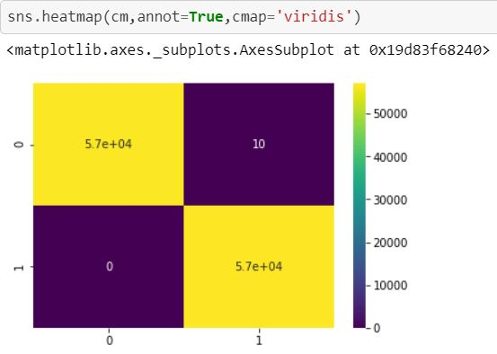
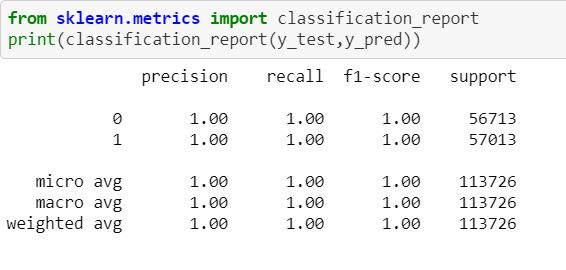

# Credit-Card-Fraud-Detection
1.classification problem.

2.imbalance dataset and make balance dataset by resampling minority class to majority class.

3.used random forest classifier with 10 decision trees.

